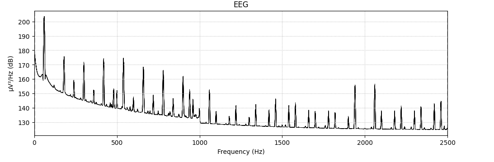
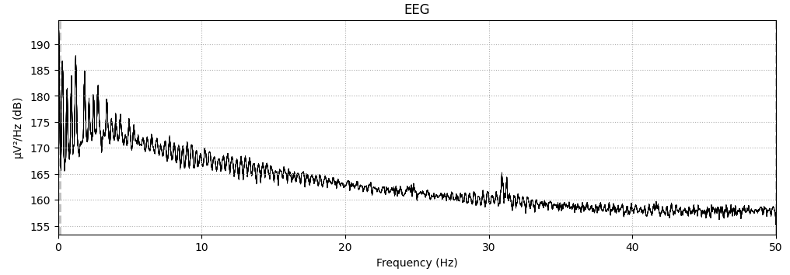
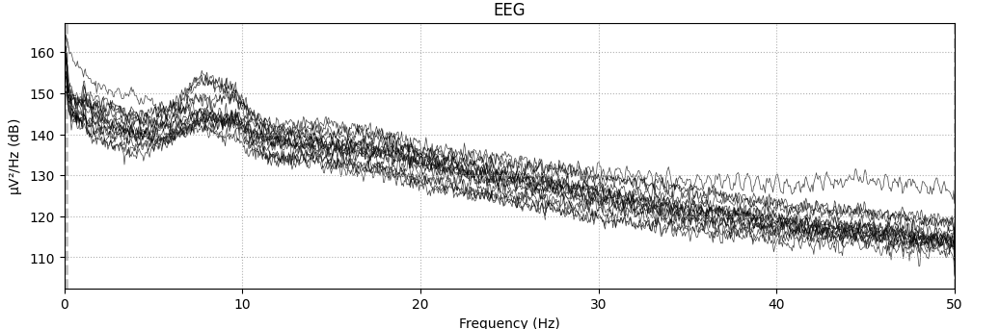
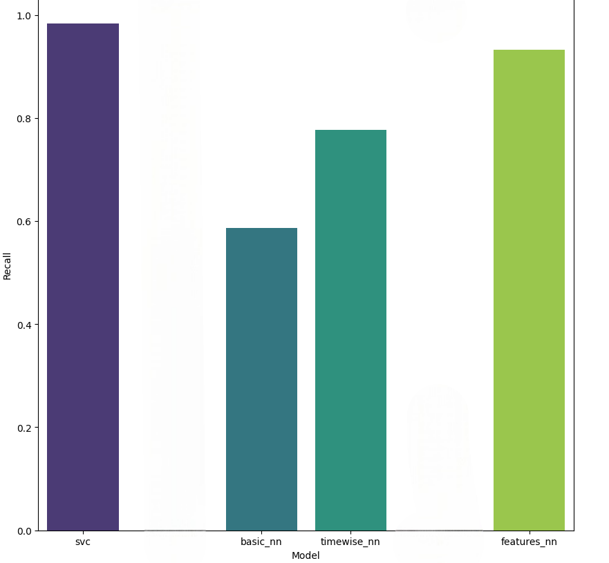

# Report
## Introduction
### Problem
Epilepsy is a chronic neurological disease that effects around 50 million people worldwide $^{[1]}$. Epilepsy, characterized by spontaneous seizures, cannot be removed completely in approximately 30% of epileptic patients $^{[1]}$. These individuals often experience anxiety due to the possibility of an unexpected seizure. Unexpected seizures can be fatal as normal activities such as driving or swimming turn fatal. This creates the need for high precision seizure detection systems which inform patients of upcoming seizures.

There are four phases of a seizure: interictal (baseline), preictal (preceding a seizure), ictal (seizure), and postictal (after seizure) $^{[2]}$. These four states can be identified in electroencephalogram (EEG) data.

In this lab, EEG data classification will be explored in several methods. Feature extraction will be an initial concern, as time-series EEG data may not be the best format to classify preictal states. Then, support vector classification will be tested as a method to classify EEG data into different states. Finally, a neural network will be built to classify preictal states in order to predict ictal states.
### Dataset
In this lab, EEG samples were taken from the "American Epilepsy Society Seizure Prediction Challenge". The EEG samples come in a ${(channels, time)}$ format, where 15 different voltage channels have ten minutes of readings.

## Data Transformation
### Preprocessing
When I first loaded the dataset, I plotted the first preictal and interictal sample. I immediately noticed a massive amount of noise in the preictal sample. The voltage of each channel has such extreme values that the channels overlap when graphing.

Initially, I though these fluctuating voltage values were indicative of an upcoming seizure. This though process guided my initial feature planning. However, when I graphed the Power Spectral Density of this sample, I noticed a trend.

With the Power Spectral Density graphed, we can see an increase in power in the harmonics of 60hz. This is likely caused by the powerline interference phenomena, since powerlines in North American run at 60hz. 

While I could have attempted to filter out the harmonics of 60Hz with a notch filter, the other EEG samples don't have the same noise. In order to not alter the entire dataset based on one sample, I decided to find another method of removing noise from the data.

In addition to filtering out line noise, I wished to reduce the computational cost of my algorithm. This led to downsampling my data to 100 Hz, which would also prevent overfitting based on high frequency components. 

Before I downsampled my data, I first ran a highpass and lowpass filter on the data. The highpass filter was run at 0.1Hz in order to remove slow drifts and irrelevant noise. These slow drifts would inhibit my predictions since I decided to break up the 10 minute sequences into 6 second sequences. The lowpass filter stopped the data at 50Hz, the Nyquist frequency of 100Hz. This would both prevent aliasing during my downsampling process, and have the side effect of filtering out powerline interference.

After filtering and downsampling the sample, the noise is reduced. However, the channels are still overlapping. This suggests that, for this sample, the signals of each channel are dominated by exterior noise. In order to fix this, I recomputed the EEG reference of each sample using the Common Average Reference. The Common Average Reference technique involves taking the mean of all the channels and subtracting that from each individual channel. $^6$ This in part reduces the shared noise and averages the error rate among channels.

Now, we can finally see power trends differing among the channels. This has introduced additional variation to the data, preparing it for use with predictive techniques.
## Experiment 
### Data Methodology

Data was prepared in two forms: time series in the shape $(15,600)$ and also features matrices derived from these time series. The information stored for each channel is below.

                    
| Kurtosis | Skew | std voltage | std power | mean power | entropy power |
|:--------:|:----:|:---:|:------------:|:-------------:|:----------------:|

These features attempt to grasp time-based changes in the data with skew and Kurtosis. Then, the standard deviation of both the voltage and power (power being the dependent variable arising from the power spectral density) identify variation caused by a preictal state. The entropy of the power attempts to address any disorder in the data.

A support Vector Classifier was grid searched on each of these datasets, providing a baseline for the neural networks to compare against.

### Layer Architecture

Then, three neural network models were created to run on the time sequence data. The architectures of these models are shown below:

#### Basic Model Architecture

| Basic Model Layers                                        |
|----------------------------------------------|
| Conv2D(24, (1, 20), 10) |
| BatchNormalization()                          | 
| Flatten()                                     | 
| Dense(1, "sigmoid")                |

The Basic Model has one Conv2d hidden node which convolves around the width of the timeseries. This forgoes any cross-channel features.

#### Time-Wise Model Architecture

| Time-Wise Model Layers                                        |
|----------------------------------------------|
| Conv2D(24,(1, 20), 10) |
| Dropout(0.2)                                 |
| BatchNormalization()                         |
|                                              |
| Conv2D(24, (1, 10), 5) |
| Dropout(0.2)                                 |
| BatchNormalization()                         |
|                                              |
| Conv2D(24, (1, 10), 5) |
| Dropout(0.2)                                 |
| BatchNormalization()                         |
|                                              |
| Conv2D(48, (1, 10), 2) |
| Dropout(0.2)                                 |
| BatchNormalization()                         |
|                                              |
| Flatten()                                    |
| Dense(20)                                    |
| Dropout(0.5)                                 |
| Dense(1, "sigmoid")               |

The Time-Wise model has four Conv2d nodes which convolve around the width of the time series. The number of filters increase as the nodes go on, and the lenght of the convolution decreases inversely. This allows the model to start with a broad feature search. In addition, dropout layers were added after each Conv2d node to prevent the model from overfitting. After the model was tested several times, increased performance was seen with lower learning rates. This led to an additional dropout node being placed directly before the final dense node.

#### Feature Matrix Model Architecture

In addition to the time series models, a feature matrix model was made for the engineered features.

| Feature Matrix Model Layers                                        |
|----------------------------------------------|
| Conv2D(12, (3, 1), 1) |
| Dropout(0.2)                                 |
| BatchNormalization()                         |
|                                              |
| Conv2D(12, (3, 1), 1) |
| Dropout(0.2)                                 |
| BatchNormalization()                         |
|                                              |
| Conv2D(24, (3, 1), 1) |
| Dropout(0.2)                                 |
| BatchNormalization()                         |
|                                              |
| Conv2D(48, (3, 1), 1) |
| Dropout(0.2)                                 |
| BatchNormalization()                         |
|                                              |
| Flatten()                                    |
| Dense(20)                                    |
| Dense(1, "sigmoid")               |

The feature matrix model includes the dropout layers after each convulotion node like the Time-Wise model, but lacks the final dropout layer since it caused poor testing scores. The convolution filters convolve around the channels, attempting to find between-channel features like the Channel-Wise model. 

### Methodology

Each of these models were fit and tested on the learning rates $5e-2$, $5e-4$, and $5e-6$. The Binary Cross Entropy was used as the loss function since there are only two labels: preictal or interictal. A batch size of $128$ was enough to increase the training speed without causing any memory issues. When training the models were given an early stop callback based on the recall score of the validation set. The models stopped training three epochs after the validation recall stopped improving. Instead of the best performing model, the last model was kept during training. This prevents a model from being kept that overfit the data.

## Results

The Support Vector Classifier outperformed all neural networks, achieving a recall rate of $97%$ on the flattened time sequences. The scores of both the Support Vector Classifier and the Features Neural Network show promise for utilization in predicting seizures. 

The high scores of the Feature Neural Network exhibit the importance of dimensionality reduction with certain data types. The initial time series were not conducive towards a prediction, so several statistical measures from both the time and spectral domains allow the model to grasp more from the data. This feature engineering prevents the model from needing to find features entirely itself.

Still, it is unknown how well these scores will hold up for larger datasets. The utilized dataset likely led to unrealistic scores since there were only 36 actual samples. This likely skewed results and made it more difficult for the neural networks to converge on an optimal solution. In addition, the testing dataset was preprocessed due to the awkward data structure it was in. 

## Conclusion
Predicting seizures by classifying preictal seizure events is a challenging neurology problem. Steady classification of events requires electroencephalography to be preprocessed as well as feature engineered. Features in both time and spectral domains can be taken, allowing models to consider different frequency bands. This lab was inhibited by the quantity of data used, causing the samples to not be indicative of true samples. Further seizure prediction research should utilize feature engineering on a vast dataset.

## Works Cited

    1. https://www.who.int/news-room/fact-sheets/detail/epilepsy
    2. https://epilepsydisease.com/seizure-stages
    3. https://academic.oup.com/book/35488
    4. https://onlinelibrary.wiley.com/doi/10.1002/epi4.12704
    5. https://www.kaggle.com/competitions/seizure-prediction/data
    6. https://www.fieldtriptoolbox.org/faq/why_should_i_use_an_average_reference_for_eeg_source_reconstruction/
    7. https://medium.com/nerd-for-tech/how-to-create-tensorflow-tfrecords-out-of-any-dataset-c64c3f98f4f8

